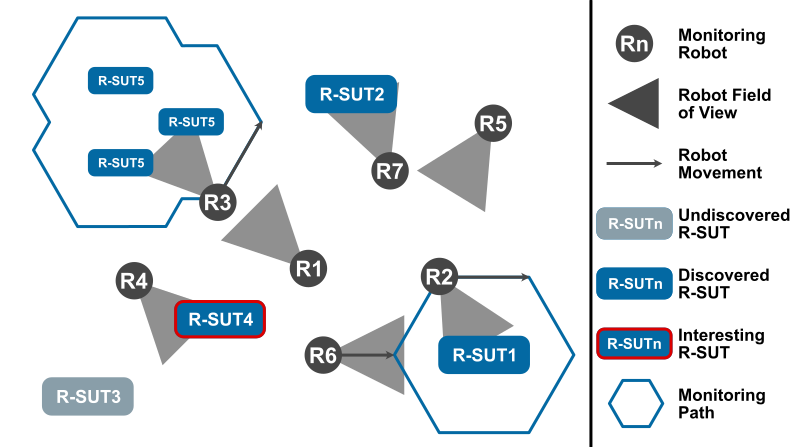
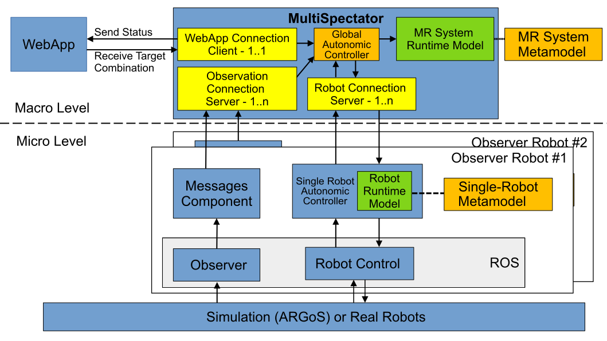
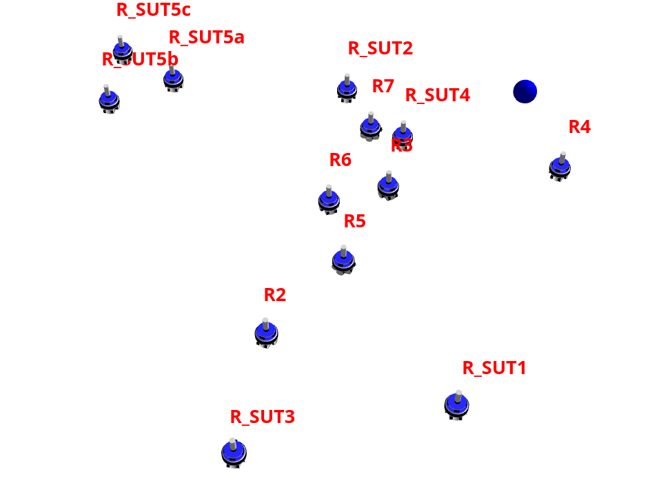

# MultiSpectator - Simulating the Monitoring of Robotic Systems under Tele-Test

[](https://binder.intel4coro.de/v2/gh/XPhantomad/VRB-CROMMS-Multispectator/main?urlpath=lab/tree/notebooks/instructions.ipynb)

This repository contains the code of our implmentation of a Multi-robot Monitoring System (MultiSpectator) simulated in ARGoS3 using CROMMS (Context-Role-Oriented Micro-Macro Swarm Programming)

## Demo - Use-Case Explanation

Click on the image to watch the [video](https://youtu.be/OBxRVPQ1SY0). 

[](https://youtu.be/OBxRVPQ1SY0)

## Quickstart with Docker in VRB (Virtual Reserach Building)

- click the binder icon at the top and run the MultiSpectator in binder
- follow the instructions in the jupyter notebook to setup the simulation

## System Description

The overall system is comprised of multiple subsystems, which can be installed and started independently.

We use ROS2 Jazzy, which is only easy to install if you follow the version restrictions for the underlying Linux.
In terms of performance, we encourage to install <b>Ubuntu 24.04 (not 24.10 or the latest version)</b> bare-bones, i.e., not in a virtual machine.
Using a virtual machine is possible, but degrades performance considerably.

A detailed description of how to install ROS2 on your system can be found [here](https://docs.ros.org/en/jazzy/Installation.html).

Besides ROS2, we use ARGoS3 as simulator. Instructions on how to install the simulator can be found below.

### Top-Level Architecture



Our prototype is comprised of five main parts in the following subdirectories:

- **/webapp**: contains the dashboard to observe the overall system and trigger monitoring requests
- **/multiSpectator**: contains the implementation of the central macro-level component, global autonomic controller, using [Contexts.jl](https://github.com/cgutsche/Contexts.jl)
- **/singleRobotController**: contains the decentralized single robot autonomic controller implemented in Python using PyEcore for the runtime model
- **/messagesComponent**: contains the messages component responsible to process the environment observations from the robots and to pass them to the MultiSpectator
- **/rosWorkspace**: contains the implementation of the [ARGoS3-ROS2-bridge](https://github.com/CPS-Konstanz/argos3-ros2-bridge) including the UI extensions for our example (e.g., showing the names of the robots in ARGoS3)

The runtime model, messages and webapp components all use Python and require an own Python Environment to install the required dependencies.
The MultiSpectator component requires Julia to be installed.

## System Requirements

- Ubuntu 24.04.2 LTS
- ROS2 Jazzy Desktop (sudo apt install ros-jazzy-desktop)
- python 3.12
- python venv (```sudo apt install python3.12-venv```)
- julia 1.11.6 (```curl -fsSL https://install.julialang.org | sh```)
- colcon (```sudo apt install colcon```)
- rqt
- (tmux 3.4 (```sudo apt-get install tmux```)) (only for starting robots one by one)

### Install ARGoS3 Simulator

- Prerequisites:
  - ```sudo apt-get install cmake libfreeimage-dev libfreeimageplus-dev qt5-default freeglut3-dev libxi-dev libxmu-dev liblua5.3-dev lua5.3 doxygen graphviz libgraphviz-dev asciidoc```
  - Freeglut 3: Problem with libglut.so.3.12
    1. Install the freeglut3-dev package with:

       ```sudo apt install freeglut3-dev```
    2. Change to the /usr/lib/x86_64-linux-gnu directory by enter: 

       ```cd /usr/lib/x86_64-linux-gnu```
    3. Now create a new symlink with name libglut.so.3 which points to libglut.so.3.12.0:

        ```ln -s libglut.so.3.12.0 libglut.so.3```
- Download argos3_simulator-3.0.0-x86_64-beta59.deb (from *Dependencies* folder)
- ```sudo apt install ./argos3_simulator-3.0.0-x86_64-beta59.deb```

Verify Installation:

- ```git clone https://github.com/ilpincy/argos3-examples.git``` to /home/[user]/Documents/
- compile and test with instructions from https://github.com/ilpincy/argos3-examples
- ```argos3 -c ./experiments/diffusion_1.argos``` should not throw an error

### Install GSL for ARGoS3-ROS2-Bridge

Original Instructions: https://coral.ise.lehigh.edu/jild13/2016/07/11/hello/

- ```sudo apt-get install libgsl-dev```
- Download gsl-latest.tar.gz (from *Dependencies* folder)
- ```tar -zxvf gsl-*.*.tar.gz```
- ```cd gsl-1.7```
- ```mkdir /home/<yourname>/gsl```
- ```./configure --prefix=/home/<yourname>/gsl```
- ```make``` (takes a while)
- ```make check```
- ```make install```
- ```'export LD_LIBRARY_PATH=*/path/to/library*:$LD_LIBRARY_PATH' >> ~/.bashrc```

## Install MultiSpectator

- ```git clone git@github.com:XPhantomad/Multispectator.git```
- ```cd Multispectator```
- ```chmod +x ./SUT-Initializer.sh```
- ```chmod +x ./SUT-Initializer-Interesting.sh```

### Setup Simulation

- copy the content of the "RosWorkspace" folder in your local ```ros_ws``` folder (/home/[user]/ros_ws)
- open a terminal in your ```/ros_ws``` folder:
    - ```source /opt/ros/jazzy/setup.bash```

        (or add it directly to the shell startup script: 
        
        ```echo "source /opt/ros/jazzy/setup.bash" >> ~/.bashrccan be added to the .bashrc```)

    - in src/argos3-ros2-bridge/CMakeLists.txt comment out line 60: ```add_subdirectory(plugins)``` for the first build
    - in ros_ws folder run: ```colcon build --packages-select argos3_ros2_bridge```
    - uncomment line 60 and build it again with: ```colcon build --packages-select argos3_ros2_bridge```
    - ```source install/setup.bash```
    - ```argos3 -c MultiSpectatorUCDemo.argos```
    - simulation should start up like in the picture below:



### Setup MultiSpectator

- open a terminal and enter julia CLI:

    - ```julia```
    - import Pkg
    - Pkg.add("Sockets")
    - Pkg.add("JSON")
    - Pkg.add("Parameters")
    - Pkg.add("Colors")

### Setup Startup-Script Folder

- in "/startup" setup a python virtual environment and install required packages:

    - ```python3 -m venv ./```
    - ```source bin/activate```
    - ```pip install -r requirements.txt```

### Setup Single-Robot-Controller individually (only requried for starting robots one by one)

- in "/singleRobotController" and "/messagesComponent" folder setup own venv:
    - ```python3 -m venv ./```
    - ```source bin/activate```
    - ```pip install -r requirements.txt```
    - run: ```python3 main.py``` for verification
    - quit application

### Setup Webapp individually (only required to run it detached from the startup script)

- in /webapp folder setup venv:
    -```python3 -m venv ./```
    - ```source bin/activate```
    - ```pip install -r requirements.txt```
    - run: ```python3 swarmDisplay.py``` for verification
    - quit application

## Run MultiSpectator Simulation

**IMPORTANT: Both steps are necessary to run the MultiSpectator Simulation**

### 1. Start ARGoS3 Environment

- open terminal in "~/ros_ws" and run: 
    - ```source install/setup.bash```
    - ```argos3 -c MultiSpectatorUCDemo.argos```
- start simulation by clicking the **play** button

### 2. Run Multi-Robot Monitoring System via the Startup Script

- in "Multispectator" folder run:
    - ```source ~/ros_ws/install/setup.bash```
    - ```source ./startup/bin/activate```
    - ```python3 ./startup/UCDemoautomatedStartupMultiSpectator.py```
- the "UCDemoautomatedStartupMultiSpectator.py" starts the Webapp, the MultiSpectator Component and for each robot the Messages Component and the Single Robot Controller
- open the Dashboard to observe the MultiSpectator and enter new targets: http://localhost:5000/


## Further Details

### For using more than 16 Robots on one machine:

- increase "MaxAutoParticipantIndex" explicitly
- create an own Cyclone-DDS config file:
    - copy the file ./cyclonedds.xml to your /home directory:
        ```xml
        <?xml version="1.0" encoding="UTF-8" ?>
        <CycloneDDS xmlns="https://cdds.io/config">
        <Domain id="any">
            <Discovery>
            <MaxAutoParticipantIndex>200</MaxAutoParticipantIndex>
            </Discovery>
            <General>
            <AllowMulticast>true</AllowMulticast>
            </General>
        </Domain>
        </CycloneDDS>
        ```
    - open a terminal and run: ```export CYCLONEDDS_URI=~/cyclonedds.xml```

## Run Systemtest and Plotting results

- see seperate [documentation](/systemtest/README.md)

## Extend the Single Robot Controller

- start by editing the [Metamodel](/models/model.ecore)
### Create SEL-SRL-MSG Execution Time Plot
- uncomment lines 37 and 77-79 in messages/main.py
- uncomment lines 95-98 and 135-139 in runtimemodel/main.py
- run simulation ([here](#run-simulation)) and execute automatedStartup.py as mentioned before [here](#run-robots-via-startup-script)
- execution times of the SEL will always be stored in time.txt
- execution times of SRL will be stored in timeSRL.txt
- execution times of Messages Component will be stored in timeMSG.txt
- after running the application for a while, stop
- plot times with ```python3 ExecutionTimeMeasurement/timePlotToolSEL_SRL_MSG.py``` executed from the main folder

### Create Plot for Scalability
- run application ([run simulation](#run-simulation) & [startup](#run-robots-via-startup-script)) for different numbers of robots ([change robot number](#change-robot-number-in-simulation))
- after each run, save the times.txt with another name (e.g. timeXRobots.txt)
- after having 4 measurements, plot them with ```python3 ExecutionTimeMeasurement/timePlotToolScalability.py``` (change names of the used timeXRobots.txt files)


## Change Robot Number in Simulation
- in your copied ROS Workspace ()"~/ros_ws") change the following parameters
- in "ros_ws_/bridge_example.argos":
    - change ```position``` of the Prey light
    - change the distributioin of robots by adjusting the ```<position>``` min and max Positions and the ```<entity>``` quantity
    ```html
    <light id="Prey"
            position="9,1,0.2"
            orientation="0,0,0"
            color="red"
            intensity="1.0"
            medium="leds" />
    ...   
    <distribute>
        <position method="uniform" min="-2.5,-2.0,0" max="11.0,4.0,0" />
        <orientation method="uniform" min="0,0,0" max="360,0,0" />
        <entity quantity="15" max_trials="100">
            <foot-bot id="fb_">
            <controller config="lrb" />
            </foot-bot>
        </entity>
        </distribute> 
    ``` 
- in "ros_ws/src/argos3-ros2-bridge/plugins/loop_functions/foraging_loop_functions/foraging_loop_functions.cpp": change the positioning of the load (black circles):
    - set the ```m_preyPosition(9,1),``` in line 9 to the same position as the Prey light
    - in "ros_ws" run: ```colcon build --packages-select argos3_ros2_bridge```
    - run ```source install/setup.bash```
    - run ```argos3 -c bridge_example.argos``` to see if it worked
- in "Contexts/swarmElementLoop/MAPE.jl" adjust the Exploration area (lines 451-452) to a new area (optimal around prey; otherwise, the robots need unduly long to find the prey and start forming a chain)
    ```julia
    # 0 Exploration
    areaPos1 = Position(5,0) 
    areaPos2 = Position(11,4) 
        if getRoles(robotSelf) === nothing
            ...
    ```
- in "startup/automatedStartup.py" change the number of loop iterations to the selected number of robots

## Docker local (old; TBD):

### Transport Chain Swarm

- ```git clone git@github.com:XPhantomad/Context-Role-Oriented-Transport-Chain-Swarm.git ```
- move to "rosWorkspace" and run ``` sudo docker build -t argos3-ros2-tchain . ```
- wait until image is ready
- run the run.sh in the main folder with sudo
- open http://localhost:5000/ in your browser to see the swarm dashboard

### Flocking Swarm

- (it can be necessary to delete the first created image, because otherwise only a new tag for this image will be added)
- checkout the "flocking" branch of the repository
- move to "rosWorkspace" and run ``` sudo docker build -t argos3-ros2-flocking . ```
- run the run.sh in the main folder with sudo
- open http://localhost:5000/ in your browser to see the swarm dashboard

### Publish Image

- Change Tag of the Image: ``` sudo docker tag [ID] xphantomad/crom-v-shape-flocking:latest ```
- Push Image: ``` sudo docker image push xphantomad/crom-v-shape-flocking:latest ```


## Open Points

- the CROM edtior from Nick Ruider has not been working in the last weeks; model images has been finished with Inkscape --> Thus the model files are not the same as in the images.
- Robots does not set their LED to black, if they crash due to an error


