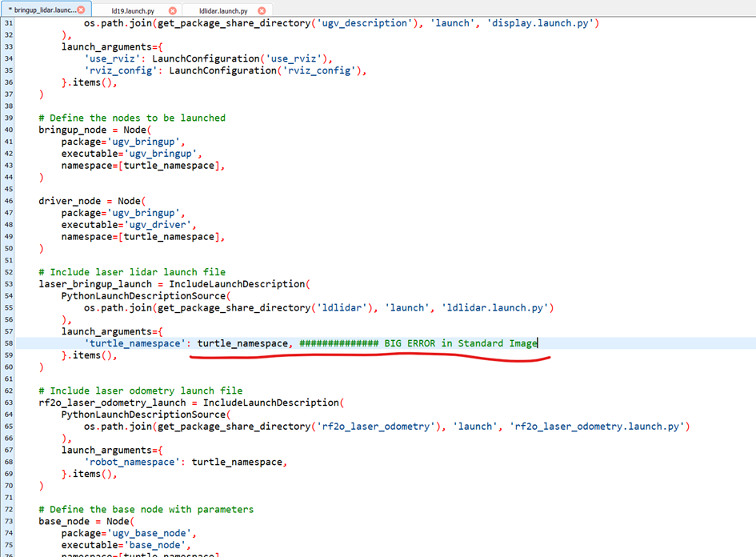
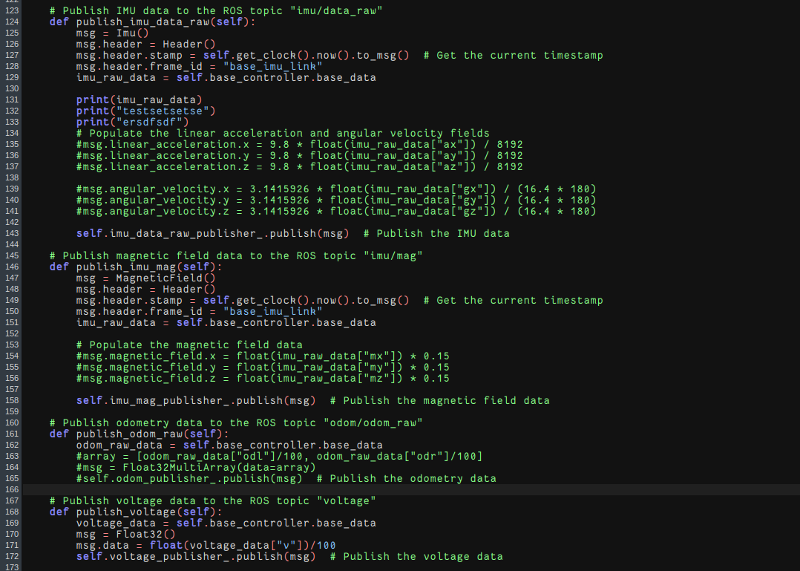

# Waveshare Rover RPI ROS2 Setup Tutorial for MultiSpectator

## Waveshare Rover - Basic Setup
- Reference: https://www.waveshare.com/wiki/UGV_Rover_PI_ROS2

### Components
- Laserscanner D500 Lidar-Kit connected to the Middle Level Coontroller (not the RPI)
- Camera
- Raspberry Pi5

## 1. Flash Image to SD Card
- download RPI Imager (https://www.raspberrypi.com/software/)
- download Image UGV_Rover_Pi_ROS2_0225.zip (https://drive.google.com/drive/folders/1tBZTGUGEfcsAjS0yGyxhdOJ5IFd6Vu3X)
- unzip the Image
- flash it to the SD Card
- increase the partition size to the full size afterwards in Gparted/...
- install it into the rover and startup

## 2. Setup Wifi-Connection
- robot creates 2 wifi accesspoints
    * SlaveController: name=UGV; password=12345678 
        * Access Slave Controller GUI via 192.168.4.1
    * HostController: name=AccessPopup; password=1234567890
        * Access Jupyter-Notebook via http://[ip adress]:8888/lab?
        * Access WebUI-App via http://[ip adress]:5000
- login to "AccessPopup" - Password: 1234567890
- open: http://192.168.50.5:8888/lab? or the adress displayed on the robots display
- setup new Wifi connection:
    - ``` bash ```
    - ``` cd AccessPopup ```
    - ``` sudo chmod +x installconfig.sh ``` 
    - ``` sudo ./installconfig.sh ```
    - choose option 5 and add a new connection
    - reconnect to the waveshare via the new connection

## 3. Disable Autostart-App
- necessary for camera usage from the Code
1. Open new terminal
2. run ``` crontab -e ```
3. choose "Nano" as Editor
4. comment out the first line (@reboot ~/ugv_pt_rpi/ugv-env/bin/python ~/ugv_pt_rpi/app.py >> ~/ugv.log 2>&1) with '#'
5. save file
6. restart robot

## 4. Connect to the Robot via SSH using MobaXterm
- install MobaXterm (https://mobaxterm.mobatek.net/download.html)
- setup new SSH Connection
- use port 22 for the RPI and port 23 for the ROS2 Docker container
- RPI: 
    - username: ws
    - password: ws
- ROS2 Docker container:
    - username: root
    - password: ws

## 5. Run the preinstalled Docker container with additional config
- setup docker container with additional config because of a broken audio socket:
``` docker
sudo docker run -dit \
  --name ugv_rpi_ros_humble \
  --net=host \
  --privileged \
  -v /dev:/dev \
  -v /home/ws:/home/ws \
  -v /tmp/.X11-unix:/tmp/.X11-unix \
  dudulrx0601/ugv_rpi_ros_humble:ugv_rpi_ros_humble 
```
- start and prepare docker container
    - ``` cd ugv_ws ```
    - ``` sudo chmod +x ./ros2_humble.sh ``` 
    - ``` ./ros2_humble.sh ``` runs the docker container and starts the ssh service on it for direct connection 
    -  manual way, if the script does not work
        - ``` docker start ugv_rpi_ros_humble ``` (start container)
        - ``` docker exec -it ugv_rpi_ros_humble /bin/bash ``` (enter bash terminal)
        - ``` service ssh start ``` (start ssh in the container)

## Play around with the Robot :)
- start each command in a seperate terminal:
    - ```  ros2 launch ugv_description display.launch.py use_rviz:=true ```
    - ```  ros2 run ugv_bringup ugv_driver ```
    - ```ros2 run ugv_tools keyboard_ctrl ```
- control the robot via the listed keyboard commands


## 6. Prepare the docker container (Bug-fixes)
### 6.1 fix the sudo apt update issue: 
- ```rm /etc/apt/sources.list.d/ros2-latest.list ```  (and all other files in this directory, if there are more)
- ``` sudo apt udpate && sudo apt upgrade ```
- add this to /home/.bashrc
```
export UGV_MODEL=ugv_rover 
export LDLIDAR_MODEL=ld19 
``` 
- ``` cd /home/ws/ugv_ws/ ```
- ``` sudo chmod +x ./build_first.sh ```
- ``` sudo chmod +x ./build_common.sh ```
- ``` sudo chmod +x ./build_apriltag.sh ```

### 6.2 fix namespace issue for keyboard control or arbitrary namespaces
- in ```ugv_ws/src/ugv_main/ugv_bringup/launch/bringup_lidar.launch ``` change this line

- for keyboard control set namespace to " " otherwise it can be set also to "fb_2" e.g.

## 7. Run Single Robot Loop of the MultiSpectator Application
- clone Multispectator repository, branch "waveshare" into the ws directory (``` git clone -b waveshare git@github.com:XPhantomad/Multispectator.git ```)
- create python venv in /runtiemmodel folder and install requirements
- ``` ros2 launch ugv_bringup bringup_lidar.launch.py use_rviz:=true ``` 
- ``` ros2 launch ugv_vision apriltag_track.launch.py ``` 
- run Web App and Multispectator Component on the central PC in the same network
- start messages Component with respective Robot number
- start runtimemodel (SRL) Component with respective robot number 

## 8. Setup April Tag Recognition
- insert all possible tag IDs in the array in ``` /home/ws/ugv_ws/src/ugv_else/apriltag_ros/apriltag_ros/cfg/tag_36h11_filter.yaml```
```
# ComposableNode should not be nested with node name and namespace
#
image_transport: 'raw'    # image format
family: '36h11'           # tag family name
size: 0.08                # default tag size
threads: 4
max_hamming: 0          # maximum allowed hamming distance (corrected bits)
z_up: true              # rotate about x-axis to have Z pointing upwards

# see "apriltag.h" for more documentation on these optional parameters
decimate: 0.0           # decimate resolution for quad detection
blur: 1.0               # sigma of Gaussian blur for quad detection
refine-edges: 1         # snap to strong gradients
debug: 0                # write additional debugging images to current working directory

approximate_sync: true
approximate_sync_tolerance: 0.2

tag_ids:    [0, 1, 2, 3, 4, 5, 6, 7, 8, 9, 10, 11, 12, 13, 14, 15, 16, 17, 18, 19, 20, 21, 22, 23, 24, 25, 26, 27, 28, 29, 30, 31, 32, 33, 34, 35, 36, 37, 38, 39, 40, 41, 42, 43, 44, 45, 46, 47, 48, 49, 50]
tag_frames: ["", "", "", "", "", "", "", "", "", "", "", "", "", "", "", "", "", "", "", "", "", "", "", "", "", "", "", "", "", "", "", "", "", "", "", "", "", "", "", "", "", "", "", "", "", "", "", "", "", "", ""]
tag_sizes:  [0.08, 0.08, 0.08, 0.08, 0.08, 0.08, 0.08, 0.08, 0.08, 0.08, 0.08, 0.08, 0.08, 0.08, 0.08, 0.08, 0.08, 0.08, 0.08, 0.08, 0.08, 0.08, 0.08, 0.08, 0.08, 0.08, 0.08, 0.08, 0.08, 0.08, 0.08, 0.08, 0.08, 0.08, 0.08, 0.08, 0.08, 0.08, 0.08, 0.08,>
```

### Check if video works:
- v4l2-ctl --device=/dev/video0 --list-formats-ext 2>/dev/null | head -5

## Appendix 
### important files
/home/ws/ugv_ws/src/ugv_main/ugv_bringup/ugv_bringup/  --> Speed Control
home/ws/ugv_ws/src/ugv_else/ldlidar/launch/  --> set correct lidar device port_name (ttyUSB0)

### Use the ugv_ws package
- export UGV_MODEL=ugv_rover
- each command in a new terminal:
    *  ros2 launch ugv_description display.launch.py use_rviz:=true
    *  ros2 run ugv_bringup ugv_driver
    *  ros2 run ugv_tools keyboard_ctrl
    * --> Keyboard Control is ready to use
- to use lidar : 
    * change lidar dev in /home/ws/ugv_ws/src/ugv_else/ldlidar/launch/ld19.launch.py to '/dev/ttyUSB*'
    * only at ugv02 without camera Rasp-Rover return right message
    * for all other kinds of robots
    
    * in /home/ws/ugv_ws/build/ugv_bringup/ugv_bringup/ugv_bringup.py
    comment these lines, because robot has not all data in his feedback-loop)

- Execute Lidar **or** SLAM **or** NAV 
    * export LDLIDAR_MODEL=ld19
    * ros2 launch ugv_bringup bringup_lidar.launch.py use_rviz:=true
    * ros2 launch ugv_slam gmapping.launch.py use_rviz:=true
    * ros2 launch ugv_slam cartographer.launch.py use_rviz:=true
    * ros2 launch ugv_nav nav.launch.py use_localization:=amcl use_rviz:=true 
