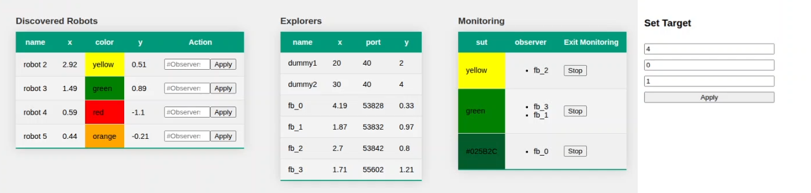

## Dashboard - Web Application

The dashboard (see picture below) provides an overview of the Monitoring Robots that are part of the MultiSpectator MoRS (Monitoring Robotic System) and the SUTs which are already detected by the Monitoring Robots. A user can simply input a desired number of observer to an SUT and start the Monitoring of it by pressing "Apply". By entering a x-y-position and a wnated number of observers in the three input fields on the right side, a fixed position monitoring task can be started. 

All currently existign Monitoring Teams can eb observed in the third table below and exited when they are no longer needed.

The MutltiSpectator assigns Monitoring Robots automatically to the SUTs, when Monitoring is requested, based on the distance to the SUT. 

If no Monitoring Robot is "free" (in Exploratino mode), nothing happens. The number of possible Monitoring Robots is currently fixed to 6. 

