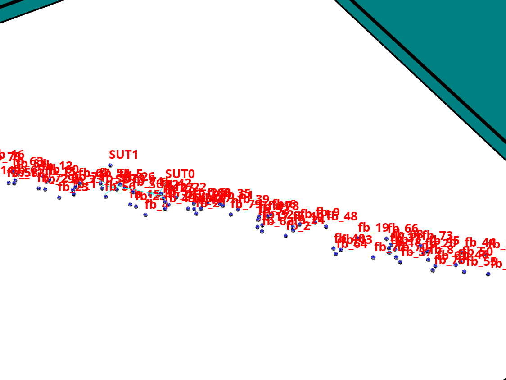

# Systemtest - Plotting

## Systemtest

This folder contains a ROS2-Node and a python Selenium application to measure the Model Fidelity of the MultiSpectator. The Model Fidelity is the time from starting an action in the web dashboard (e.g. setting a new monitoring target) till the robot starts its movement in the required direction.

- ```testROSNode.py``` supervises the angle value of the cmd_vel topic (because robot has most likely to rotate before driving in the new tareget direction)
- ```testGoalAdaption.py``` starts the MultiSpectator Application
    - fixed-position inspection is used for the time measurement (Position are on the diagonal axis through the arena - see picture)


Systemtest with 80 robots, 10 Monitoring teams with 8 constituents in each.

## Plotting

- ```timePlotToolScalability.py``` provides a simple matplotlip implementation to:
    - visualize the measurements in a boxplot and
    - output the median and average Model Fidelity times in the shell

## Installation

- create python venv: ```python3 -m venv .```
- activate venv: ```source bin/activate```
- install requirements: ```pip install -r requirements.txt```

## Run

### 1. Start ARGoS3 Simlation Environment

- open terminal in "~/ros_ws" and run:
    - ```source install/setup.bash```
    - ```argos3 -c monitoringEnvironment.argos```
- start simulation by clicking the **play** button

### 2. Start the Systemtest

- run Systemtest: ```python3 testGoalAdaption.py```
- run timePlotTool:
    - navigate to the directory containing the measurement .txt files
    - adjsut the file-names and number of needed series
    - ```python3 ./<path-to-dir>/systemtest/timePlotToolScalability.py```

### 3. Change the number of Robots and Teams for each test

- see [Environment Docs](/rosWorkspace/README.md)
- in ```testGoalAdaption.py```:
    - update the "robotCount" attribute
    - define a number of Monitoring Teams and the team size